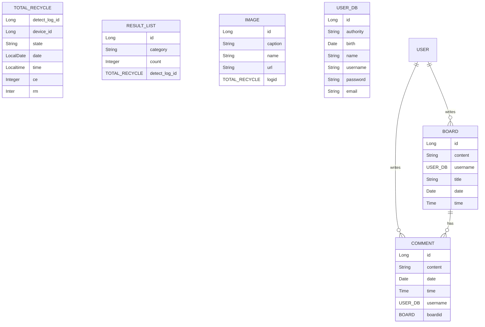

# __병 판별 분석 웹서비스__  

## 1. 프로젝트 설명  
> **부산대학교 k - digital 3기**   **개발기간 : 2023.08.18 ~ 2023.09.18**    

## 2. 팀원  
  
|      Front - End       |          Back - End         |          DA         |                                                              
|:------------------------------------------------------------------------------: | :---------------------------------------------------------------------------------------------------------------------------------------------------: | :---------------------------------------------------------------------------------------------------------------------------------------------------: | 
| 이수호 | 허지은 | 이예진 |
|||| 
|   [@suho0815](https://github.com/suho0815)  |     [@JIeunhuh](https://github.com/JIeunhuh)  |    [@YeDongVibe](https://github.com/YeDongVibe)  |

##  프로젝트 소개   
 
##  시작 가이드(요구사항, 설치 및 실행)        

## -- 추가 될 수 있음 --  
    
##  기술 스택  

## ERD  

+-------------------+         +-------------------+         +-------------------+         +-------------------+         +-------------------+         +-------------------+
|   TOTAL_RECYCLE   |         |    RESULT_LIST    |         |       IMAGE       |         |      USER_DB     |         |       BOARD       |         |     COMMENT     |
+-------------------+         +-------------------+         +-------------------+         +-------------------+         +-------------------+         +-------------------+
| - detect_log_id: Long |    | - id: Long               |       | - id: Long                   |      | - id: Long                   |     | - id: Long                  |
| - device_id: Long   |    | - category: String    |       | - caption: String       |      | - authority: String       |     | - content: String         |
| - state: String          |    | - count: Integer         |       | - name: String            |      | - birth: Date               |     | - title: String             |
| - date: LocalDate     |    | - detect_log_id: Long |       | - url: String               |      | - name: String           |     | - date: Date                  |
| - time: LocalTime     |                                            | - logid: TOTAL_RECYCLE|      | - username: String      |     | - time: Time                  |
| - ce: Integer               |                                            +-------------------+         | - password: String       |                                      | - username: USER_DB|
| - rm: Inter                  |                                                                                                       | - email: String               |                                      | - date: Date                    |
+-------------------+                                                                                                      +-------------------+         | - time: Time                    |
                                                                                                                                                                                   +-------------------+

##  주요 기능   

##  아키텍쳐   