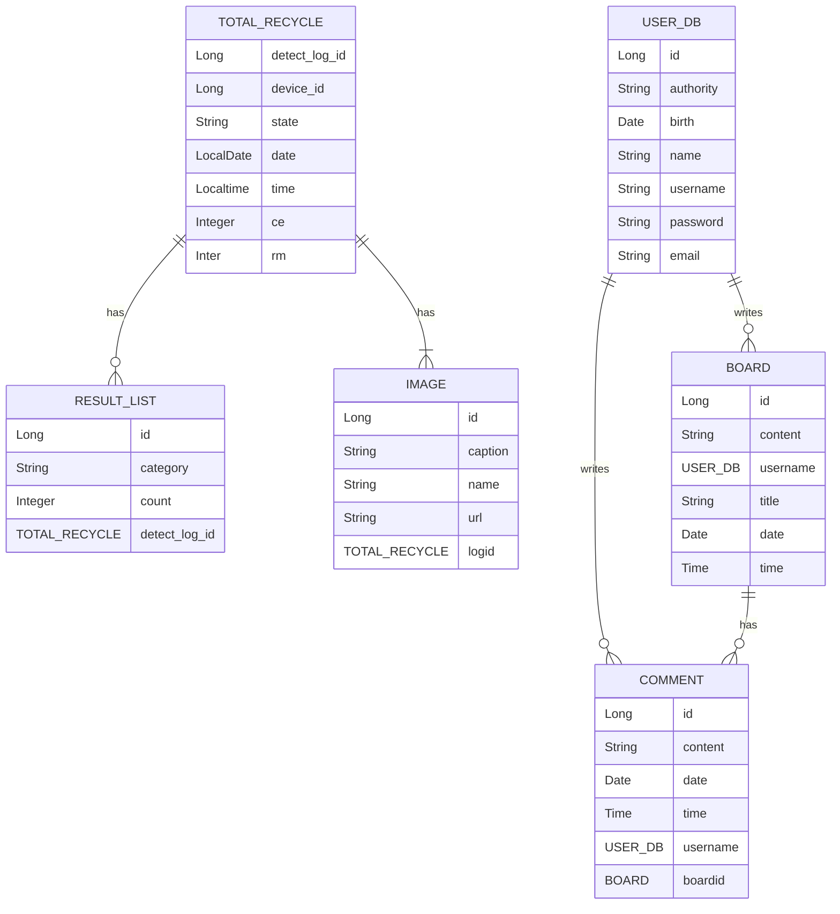

# __병 판별 분석 웹서비스__  

## __프로젝트 설명__  
> **부산대학교 k - digital 3기**   **개발기간 : 2023.08.18 ~ 2023.09.18**    

## __팀원__  
  
|      Front - End       |          Back - End         |          DA         |                                                              
|:------------------------------------------------------------------------------: | :---------------------------------------------------------------------------------------------------------------------------------------------------: | :---------------------------------------------------------------------------------------------------------------------------------------------------: | 
| 이수호 | 허지은 | 이예진 |
|||| 
|   [@suho0815](https://github.com/suho0815)  |     [@JIeunhuh](https://github.com/JIeunhuh)  |    [@YeDongVibe](https://github.com/YeDongVibe)  |

##  __🔎 프로젝트 요구사항__  
       
 - 재활용 분류기에 폐기물이 투입되면 재활용 가능 여부, 분류날짜, 종류 등의 정보를 제공받아 실시간으로 특정 기간에 분류된 정보를 웹 화면에 가시화  
 - 이미지 캡셔닝을 활용환 분류된 폐기물 이미지와 해당하는 캡션(설명 글)을 웹 화면에 가시화  
 - 특정 기간 및 종류별 수량, 탄소배출량, 원재료 판매 수익 등을 그래프로 나타내어 시각화  
 - 해당 프로젝트는 '서르'에서 제공하는 데이터를 기반으로 이미지 캡셔닝 모델을 개발하여 웹 서비스를 제공  

 ##  __🔎 주요 기능__  
      
 - 이미지 캡셔닝 모델을 활용환 분류된 쓰레기 이미지에 대한 분석 글을 제공(재활용 불가 이유, 폐김루 종류 등)  
 - 기간별, 일자별, 카테고리별 재활용 가능한 폐기물의 탄소배출량, 원재료 판매 수익 등의 통계자료를 시각화하여 제공  
 - 전체 폐기물 정보 데이터 자료조회 제공, 재활용 가능 여부를 나누어 그래프로 시각화하여 정보 제공   
 - 재활용 분리수거 가이드를 통하여 사용자에게 올바른 분리수거 가이드를 제공
 - 문의 게시판을 통해 사용자가 관리자에게 문의사항 게시 가능  

##  __🔎 시작 가이드(요구사항, 설치 및 실행)__  
          
> Back-End  
- Java : v- JDK 18.0.2.1
- Spring Boot : v.3.1.2
- PostgresQL : v.11.2
> Front-End  
- Node.js : v.18.16.0
- React : v.18.2.0
> D/A  
- 가상 환경 구성 후 필요한 라이브러리 설치 
- Python : v.3.10  
- transformers : v.4.33.1    
- PyTorch : 2.0.1+cpu  

## __역할 분담__  

> Front-End  
- React 컴포넌트 적용하여 웹페이지 구현  
- Tailwind CSS 적용  
> Back-End  
- REST API 설계  
- DB 설계  
- 사용자 인증, 인가 구현
- 예외처리  
> D/A    
- 폐기물의 이미지를 분석하여 캡셔닝 제공하는 모델 개발 

    
## __🔎 REST API__  
###  Spring Boot  
| ID | Method | URI | Description |
| --- | --- | --- | --- |
| 1 | POST  | /signup |회원가입 |
| 2 | POST | /login | 로그인 |
| 3 | POST | /manager/files/fileupload | 파일 업로드 |
| 4 | GET | /images/{filename} | 이미지 보기 |
| 5 | GET | /public/download/{filename} | 이미지 다운로드 |
| 6 | POST | /manager/files/image | 이미지 업로드|
| 7 | POST | /manager/files/imagefile | 이미지 폴더 업로드 |
| 8 | GET | /public/download/{filename} | 이미지 다운로드 |
| 9 | GET | /public/statistics/readAllrecycles | 모든 재활용 데이터 자료조회 |
| 10 | GET | /public/statistics/types/{types} | 분리수거 카테고리별 통계 |
| 11 | GET | /public/statistics/times/{time}/{time2} | 시간별 통계 |
| 12 | GET | /public/statistics/days/{day}/{day2} | 일자별 통계 |
| 13 | POST | /public/board/insertBoard | 게시판 게시글 등록 |
| 14 | PUT | /public/board/updateBoard/{id} | 게시판 게시글 수정 |
| 15 | DELETE | /public/board/deleteBoard/{id} | 게시글 삭제 |
| 16 | GET | /public/board/boardList | 게시글 목록 보기 |
| 17 | GET | /public/board/searchBoard/nickname | 게시글 검색(사용자 id 검색) |
| 18 | GET | /public/board/searchBoard/title | 게시글 검색(게시글 제목 검색) |
| 19 | GET | /public/board/searchBoard/keyword | 게시글 검색(게시글 제목 + 내용 검색) |
| 20 | POST | /manager/comments/insertComment | 게시글 댓글 작성 |
| 21 | PUT | /manager/comments/updateComment/{id} | 게시글 댓글 수정 |
| 22 | DELETE | /manager/comments/deleteComment/{id} | 게시글 댓글 삭제 |
| 23 | GET | /public/comments/readComment/{id} | 댓글 목록 |
| 24 | POST | /manager/prediction/put_image | 이미지 분석 캡션 반환|  
  
###  Flask
| ID | Method | URI | Description |
| --- | --- | --- | --- |
| 1 | POST | /process_image | 이미지 캡셔닝 |

## __🔎 ERD__  

##  __🔎 아키텍쳐__   